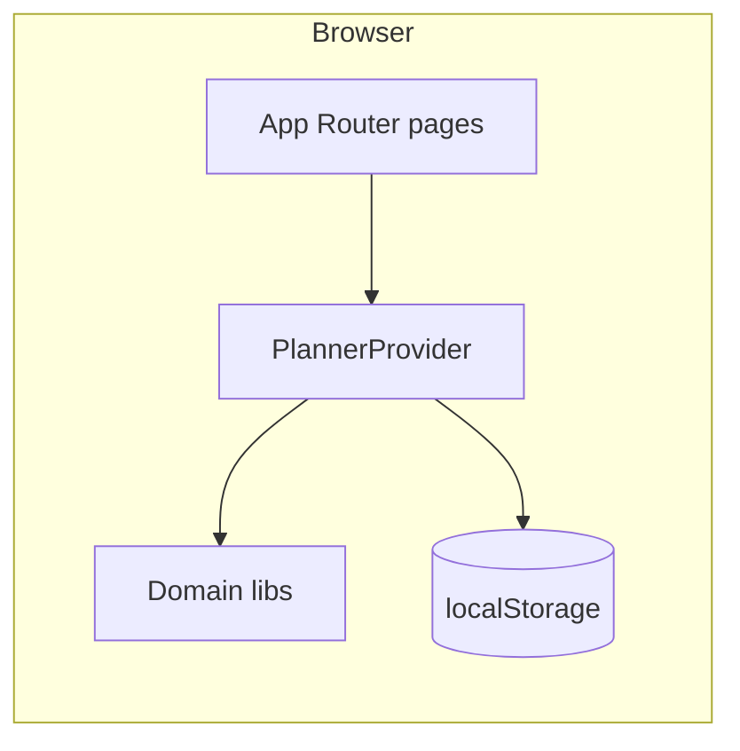

# Study Planner — Technical & Product Documentation

| Field | Value |
|--------|--------|
| **Product** | Study Planner |
| **Repository** | `study-planner` (Next.js application) |
| **Document version** | 1.0 |
| **Application version** | 0.1.0 |
| **Last updated** | May 2026 |

---

## Executive summary

Study Planner is a client-first web application that helps learners organise study around **subjects**, actionable **tasks**, and calendar-based **study sessions**. State persists entirely in the browser (`localStorage`), with optional **JSON backup and restore**. The stack is **Next.js 16** (App Router), **React 19**, and **TypeScript**, styled with **Tailwind CSS 4**. Typical deployment is **Vercel**, sourced from **GitHub**, giving a stable public URL while keeping core functionality independent of a dedicated backend.

This document describes **what** the product is, **why** it was built this way, **how** it is structured, **key features and benefits**, a **development roadmap**, **issues encountered and resolutions**, and notes on **exporting this document to PDF**.

---

## Table of contents

1. [Purpose and scope](#1-purpose-and-scope)  
2. [What the application is](#2-what-the-application-is)  
3. [Objectives and rationale](#3-objectives-and-rationale)  
4. [Technical architecture](#4-technical-architecture)  
5. [Alternative implementation approaches](#5-alternative-implementation-approaches)  
6. [Key features, uses, and benefits](#6-key-features-uses-and-benefits)  
7. [Duplicate titles and topic checklists](#7-duplicate-titles-and-topic-checklists)  
8. [Development lifecycle](#8-development-lifecycle)  
9. [Issues encountered and how they were addressed](#9-issues-encountered-and-how-they-were-addressed)  
10. [Deployment and operations](#10-deployment-and-operations)  
11. [Future considerations](#11-future-considerations)  
12. [Appendix: Exporting this document to PDF](#appendix-exporting-this-document-to-pdf)  
13. [Document summary](#13-document-summary)

---

## 1. Purpose and scope

**Purpose:** Provide a lightweight, trustworthy planner that works in the browser without mandatory accounts or server-side databases for day-to-day use.

**In scope:** Subject management, task CRUD, weekly scheduling, availability modelling (types present in state), settings for backup/restore and maintenance workflows (duplicate consolidation).

**Out of scope (current version):** Multi-user collaboration, server-authoritative sync, native mobile apps, and institutional SSO—these remain extension opportunities.

---

## 2. What the application is

Study Planner is a **multi-page** Next.js application using the **App Router**. Primary routes include:

| Route | Role |
|--------|------|
| `/` | Landing / dashboard entry |
| `/subjects` | Subject categories, templates, per-subject topic checklists |
| `/tasks` | Task list, filters, manual entry, topic fills |
| `/schedule` | Week-based session planning linked to tasks |
| `/timetable` | Timetable-oriented view (supporting structure) |
| `/settings` | Backup, restore, demo data, duplicate merge tooling |

All planner entities share a single **application state** surfaced through **React context** (`PlannerProvider`). Mutations update React state and trigger persistence.

---

## 3. Objectives and rationale

| Objective | Rationale |
|-----------|-----------|
| Low friction | Students open a URL and begin planning immediately. |
| Privacy-by-default | Data stays on-device unless the user exports JSON. |
| Recoverability | Downloadable backups mitigate browser clears or device changes. |
| Maintainability | Clear separation between UI routes and domain libraries (templates, concept tasks, merge/dedupe helpers). |
| Deployability | Static-friendly hosting aligns with Next.js and Vercel defaults. |

---

## 4. Technical architecture

### 4.1 Stack

- **Runtime framework:** Next.js **16.2.4**  
- **UI:** React **19.2.4**, TypeScript **5.x**  
- **Styling:** Tailwind CSS **4**  
- **Persistence:** Browser `localStorage` via `STORAGE_KEY` (`study-planner-v1` in types module)

### 4.2 Domain model (high level)

- **Subject:** Name, colour, qualification category, timestamps.  
- **Task:** Title, optional subject link, due date, priority, estimate, notes, status, completion metadata.  
- **StudySession:** Date, start/end minutes, optional task link, session status.  
- **AvailabilityRule:** Weekly availability windows (stored with planner state).

### 4.3 High-level data flow



User actions on pages invoke context methods (e.g. `upsertTask`, `upsertSubject`, `mergeDuplicateTaskGroups`). Effects persist consolidated state to `localStorage` so refreshes restore continuity.

### 4.4 Notable libraries / modules

- **`subjectTemplates`** — Qualification templates and naming normalisation.  
- **`subjectConceptTasks`** — Topic checklist derivation and bulk/per-subject application.  
- **`taskTitleDedupe` / `mergeDuplicateTasks`** — Duplicate detection and merge semantics for maintenance.

---

## 5. Alternative implementation approaches

When designing a study planner web app, teams commonly evaluate:

| Approach | Description | Fit for this product |
|----------|-------------|----------------------|
| **Client-only SPA/PWA** | State in browser or IndexedDB; optional export | **Chosen baseline** — aligns with current architecture |
| **BaaS or custom API + DB** | Authenticated multi-device sync | Strong for cohort products; adds auth and hosting cost |
| **Hybrid** | Local-first with optional cloud sync | Balanced path for a later phase |
| **Mobile-native** | iOS/Android dedicated apps | Higher distribution friction for coursework tooling |

The present implementation prioritises **speed to value** and **operational simplicity** while leaving a credible upgrade path toward sync later.

---

## 6. Key features, uses, and benefits

### Features

- **Structured subjects** with categories (e.g. GCSE, A Level, BTEC, university, custom).  
- **Template-driven bulk adds** for common qualification lists.  
- **Topic checklists** — curated task titles per subject template to accelerate setup.  
- **Rich tasks:** priorities (`low` / `medium` / `high`), statuses (`todo` / `doing` / `done`), optional due dates and estimates, notes.  
- **Schedule:** Sessions tied to calendar dates and optionally linked tasks; navigation hooks between schedule and tasks.  
- **Settings:** JSON export/import, demo dataset load, reset, **duplicate title merge** with session reassignment.

### Typical uses

- Weekly planning across subjects.  
- Tracking revision topics derived from syllabi-style checklists.  
- Blocking time on a calendar while preserving links back to concrete tasks.

### Benefits

- **Predictable behaviour** for backups (single JSON artifact).  
- **Guardrails** against accidental duplicate manual titles while allowing checklist-driven flexibility across subjects (see §7).  
- **Operational clarity**: deploy from Git; smoke-test with production builds (`npm run build`).

---

## 7. Duplicate titles and topic checklists

To balance usability and data hygiene:

- **Manual task create/update:** Normalised titles must remain **unique across the entire planner**. Conflicting saves are rejected with user-visible feedback.  
- **Per-subject topic checklist:** When adding missing checklist tasks for **one subject**, inserts may reuse a normalised title that already exists on **another subject**. Inserts use a controlled path (`allowDuplicateNormalizedTitle` on task upsert) so manually typed tasks cannot bypass global uniqueness.  
- **Bulk “fill everywhere” / template flows:** Continue to respect **planner-wide** duplicate avoidance so mass imports do not explode redundant rows.  
- **Maintenance:** Settings exposes duplicate detection with **merge** semantics (consolidate notes and fields, reassign sessions, delete redundant rows).  
- **Imports:** Restoring backups rejects datasets that already contain duplicate normalised titles at import time.

---

## 8. Development lifecycle

Recommended sequence that reflects how this codebase evolved:

1. **Scaffold** Next.js (App Router), TypeScript, Tailwind.  
2. **Define** core types (`PlannerState`, entities).  
3. **Implement** `PlannerProvider` with immutable-style updates and persistence hooks.  
4. **Build** primary surfaces: Subjects → Tasks → Schedule → Settings.  
5. **Integrate** topic template libraries and checklist application logic.  
6. **Harden** UX: accessible forms, edit flows, scroll/focus affordances, confirmation dialogs.  
7. **Enforce** business rules: global manual uniqueness, selective checklist bypass, import validation.  
8. **Add** maintenance tooling (duplicate merge).  
9. **Verify** with `npm run build`, lint, and manual QA on priority journeys.  
10. **Deploy** via GitHub → Vercel; confirm production branch alignment (`master` or `main`).

---

## 9. Issues encountered and how they were addressed

| Topic | Symptom | Resolution |
|-------|---------|------------|
| Topic checklist completeness | Rows skipped when the same title existed on another subject | Per-subject checklist uses planner-local dedupe only; inserts allow controlled duplicate normalisation across subjects via dedicated upsert option |
| Edit affordance | User believed “Edit” failed | Scroll/focus task form; surface subject rename conflicts instead of silently resetting form |
| Schedule editing | Linked task completed — missing `<option>` | Include linked done task in dropdown while editing |
| Global duplicates | Legacy or imported duplicates | Settings merge tool consolidates rows and reassigns sessions |
| Manual vs checklist rules | Need strict typing but flexible imports | Split enforcement: manual path uses global uniqueness; checklist path uses scoped insert flag |
| Live deployment | Changes not visible on Vercel | Verify Git push to tracked branch, Vercel deployment success, hard refresh / cache |

---

## 10. Deployment and operations

- **Source control:** Git; `master` branch used in the referenced workflow (adapt if production uses `main`).  
- **Hosting:** Vercel linked to GitHub — pushes trigger builds.  
- **Build:** `npm run build` (production compile + static generation as configured).  
- **Data note:** `localStorage` is **per origin**. Production (`https://…`) and `localhost` do **not** share data—users migrate via **Settings → backup JSON**.

---

## 11. Future considerations

- Authenticated accounts and encrypted cloud sync.  
- Shared calendars and ICS export.  
- Notifications / reminders (push or email—requires backend).  
- Deeper analytics (time-on-task, streaks) with explicit privacy policy.  
- Automated tests around merge/dedupe and checklist application logic.

---

## Appendix: Exporting this document to PDF

**From this repository (recommended on Windows):** regenerate printable HTML and a PDF using Microsoft Edge headless (no extra Chromium download):

```bash
npm run docs:pdf
```

Outputs:

- `docs/STUDY_PLANNER_DOCUMENTATION.html` — open in any browser; **Print → Save as PDF** if you prefer manual export  
- `docs/STUDY_PLANNER_DOCUMENTATION.pdf` — generated when Edge is installed at the standard path  

HTML only:

```bash
npm run docs:html
```

**Microsoft Word / Google Docs:** Paste sections or open HTML/Markdown after conversion, then **Save as PDF** / **Download → PDF**.

**Pandoc** (when installed system-wide):

```bash
pandoc docs/STUDY_PLANNER_DOCUMENTATION.md -o Study_Planner_Documentation.pdf --toc
```

**VS Code:** Use a “Markdown PDF” extension if preferred.

For formal submissions, add a **cover page** (institution logo, module code, author) in Word or your PDF editor after export.

---

## 13. Document summary

Study Planner delivers a **focused student workflow**—subjects, tasks, and scheduled sessions—within a **modern Next.js application** that persists locally and deploys cleanly to **Vercel**. Architectural discipline (central context, typed domain model, dedicated libraries for templates and dedupe) keeps behaviour understandable as features grow. Documented trade-offs—especially **manual title uniqueness** versus **checklist flexibility**—were resolved with explicit code paths and maintenance tooling. Together, these choices yield a **professional, explainable product** suitable for coursework demonstration, portfolio presentation, or continued iteration toward sync-enabled offerings.

---

*End of document.*
